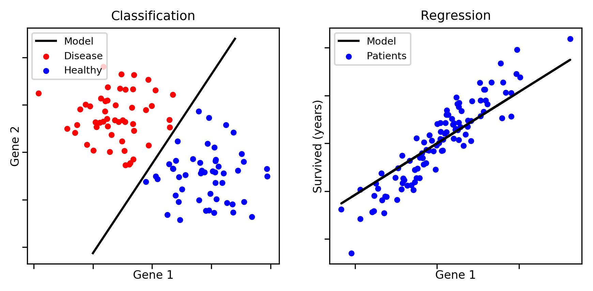
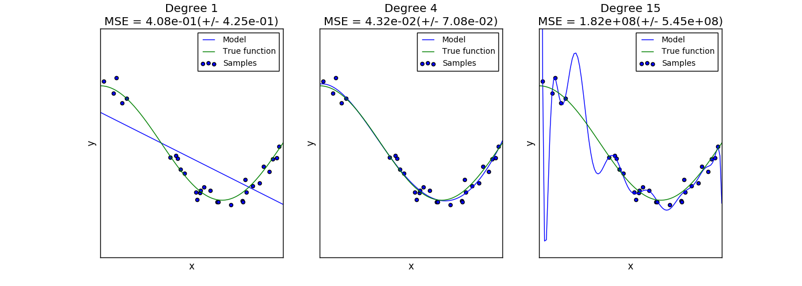

<a href="../../#table-of-contents"><-- Back to table of contents</a>

# The basics

## Type of learning problems

In supervised machine learning, data sets are collections of learning examples of the form *(x, y)*, where *x* is a **feature vector** and *y* is its corresonding **target value**. Features are observed variables that describe each example. The goal of a machine learning algorithm is to produce a **model** (*h*) that **accurately estimates** *y* given *x*, i.e., *h(x) &asymp; y*.

* **Classification:** Each learning example is associated with a **qualitative** target value, which corresponds to a class (e.g., cancer, healthy). There can be two classes ([binary classification](https://en.wikipedia.org/wiki/Binary_classification)) or more ([multiclass classification](https://en.wikipedia.org/wiki/Multiclass_classification)).

* **Regression:** Each learning example is associated with a **quantitative** target value (e.g., survial time). The goal of the model is to estimate the correct output, given a feature vector.



 **Note:** There exists another type of supervised learning problem called [structured output prediction](https://en.wikipedia.org/wiki/Structured_prediction). This setting includes classification and regression, in addition to the prediction of complex structures, such as texts and images. However, this goes beyond the scope of this tutorial.


## Typical experimental protocol

### Training and testing sets

When performing a machine learning analysis on a data set, it is important to keep some data aside to estimate the accuracy the learned model.

* **Training set:** set of learning examples used to train the algorithm
* **Testing set:** set of learning examples used to estimate the accuracy of the model


 **Note:** It is extremely important to split the data set **randomly**. You may not choose which examples go to the training and testing sets.

```python
from sklearn.model_selection import train_test_split
X_train, X_test, y_train, y_test = train_test_split(X, y, train_size=0.8)
```

### Cross-validation

Some learning algorithms have **parameters** that must be **set by the user**. Such parameters are called **hyperparameters**. For example, when learning decision trees, the maximum depth of the tree is a hyperparameter.

Usually, we try many values for each hyperparameter and select the values that lead to the most accurate model.

 **Question:** Can we use the testing set to select the hyperparameter values that lead to the most accurate model?

 **Answer:** No! Doing so would reveal information about the testing set to the learning algorithm. We would have an over-optimistic evaluation of our model's accuracy.

Instead, we use a method called **k-fold cross-validation**. That is, we partition the training set into *k* subsets of equal size, called folds. 


Then, we iteratively leave one fold out for testing and train on the *k-1* remaining folds. Each time, we estimate the accuracy of the obtained model on the left out fold. Finally, we select the hyperparameter values that lead to the greatest accuracy, averaged over the *k* folds. 


This is done for every combination of hyperparameter values and the one that leads to the greatest "CV score" is selected. It is then used to retrain the algorithm on the entire training set. This yields a model, which we can now evaluate on the testing set.

```python
from sklearn.model_selection import GridSearchCV
from sklearn.tree import DecisionTreeClassifier
param_grid = {'max_depth': [1, 5, 10, 50, 100]}
cv = GridSearchCV(DecisionTreeClassifier(), param_grid)
cv.fit(X_train, y_train)
test_predictions = cv.predict(X_test)
```

### Assessing the accuracy of a model

#### Metrics

Many metrics can be used to measure the correctness of a model's predictions. In this tutorial, we will use the following metrics:

* **Classification:** we will use the [**accuracy**](http://scikit-learn.org/stable/modules/model_evaluation.html#accuracy-score), which is the proportion of correct predictions in a set of examples (best: 1, worst: 0).

* **Regression:** we will use the [**coefficient of determination**](https://en.wikipedia.org/wiki/Coefficient_of_determination), which measures the proportion of the variance in the target values that is explained by the model (best: 1, worst: 0).

 **Note:** For more metrics, see [http://scikit-learn.org/stable/modules/model_evaluation.html](http://scikit-learn.org/stable/modules/model_evaluation.html).


#### Overfitting and Underfitting

* **Overfitting:** The model is **highly accurate on the training set**, but **performs poorly on the testing set**. Results from using an overly complex model that fits the noise in the input data.

* **Underfitting:** The model **performs poorly on the training set and on the testing set**. Results from using a model that is not complex enough to model that quantity of interest.

This figure shows an example of underfitting (left) and overfitting (right):

Source: [http://scikit-learn.org/stable/auto_examples/model_selection/plot_underfitting_overfitting.html](http://scikit-learn.org/stable/auto_examples/model_selection/plot_underfitting_overfitting.html)

**Summary table:** Accuracy of the model in over/under-fitting situations.

|              	| Overfitting 	| Underfitting 	|
|--------------	|-------------	|--------------	|
| Training Set 	| Good        	| Poor         	|
| Testing Set  	| Poor        	| Poor         	|

<br />
Learning algorithms generally have **regularization** hyperparameters, which are used to limit overfitting. For example, the maximum depth of a decision tree.


### Interpretable vs black-box models

The figure below shows the predictions of various learning algorithms for 3 datasets of varying complexity.

* Notice that some models produce very complex decision boundaries (e.g., nearest neighbours), whereas some produce very simple boundaries (e.g., SCM-conjunction).

* Some algorithms produce highly complex models that are difficult to interpret. For instance, the RBF SVM maps the data to a new feature space of very large dimensions and finds a linear separator that accurately classifies the data in this space.
 
* In contrast, decision trees and SCMs learn models that rely on answering a series of questions of the form: "Is the value of feature #1 < 5?". This is much more interpretable.

* Observe that complex models do not always lead to more accurate predictions (e.g., last row, Decision Tree performs as well as RBF SVM).


### Basic Scikit-learn syntax

This code snippet trains a decision tree classifier on a randomly generated dataset, using cross-validation to select the hyperparameter values. Running learning algorithms on your data is really this simple with the `sklearn` package.

```python
from sklearn.datasets import make_classification
from sklearn.metrics import accuracy_score
from sklearn.model_selection import train_test_split, GridSearchCV, KFold
from sklearn.tree import DecisionTreeClassifier

# Create a random dataset and partition it into a training and testing set
X, y = make_classification(n_samples=100)
X_train, X_test, y_train, y_test = train_test_split(X, y, train_size=0.8)

# Define the candidate hyperparameter values
params = dict(max_depth=[1, 3, 5, 10, 50, 100], min_samples_split=[2, 5, 10, 100])

# Perform 5-fold cross-validation on the training set
cv_protocol = KFold(n_splits=5, shuffle=True)
cv = GridSearchCV(DecisionTreeClassifier(), param_grid=params, cv=cv_protocol)
cv.fit(X_train, y_train)

# Compute predictions on the testing set using the selected hyperparameters
print("Accuracy:", accuracy_score(y_true=y_test, y_pred=cv.predict(X_test)))

# You can also access the DecisionTreeClassifier using the best hyperparameters
print("The model is:", cv.best_estimator_)

# and the value of the selected hyperparameter values
print("The selected hyperparameter values are:", cv.best_params_)
```

Scikit-learn's documentation offers many great examples and tutorials (see [here](http://scikit-learn.org/stable/auto_examples/index.html), [here](http://scikit-learn.org/stable/tutorial/index.html), and [here](http://scikit-learn.org/stable/user_guide.html)).

### Exercises

 **Exercise 1:** In this exercise, we will see how the complexity of the learned model affects overfitting and underfitting. We use [linear regression](http://scikit-learn.org/stable/modules/generated/sklearn.linear_model.LinearRegression.html) combined with [polynomial features](http://scikit-learn.org/stable/modules/generated/sklearn.preprocessing.PolynomialFeatures.html) of various degrees. Polynomial features allow to model non-linear functions with linear models. For instance, supposing that all examples are represented by a single feature  the corresponding polynomial features for a degree of 3 are .


Run the following command to start the interactive visualization.

```bash
make basics.model.complexity
```

Move the slider at the bottom of the plot to control the degree of the polynomial features. As the degree increases, so does the complexity of the learned model.

1. Can you find a value of the degree hyperparameter that leads to underfitting?

2. Can you find a value of the degree hyperparameter that leads to overfitting?

3. If you were writing a paper about this model, which degree value would you use and which coefficient of determination would you report?

**Solution:** [click me](./solutions/model_complexity/)

<br />

 **Exercise 2:** Train a [RBF kernel Support Vector Machine](http://scikit-learn.org/stable/modules/generated/sklearn.svm.SVC.html) classifier on the [breast cancer](http://scikit-learn.org/stable/modules/generated/sklearn.datasets.load_breast_cancer.html) data set from the UCI repository. To do so, run the following command.

```bash
make basics.model.selection
```

1. Is the accuracy on the training set a good estimator of the accuracy on the testing set?

2. Given the information at hand, which combination of hyperparameters should you choose? Why?

3. Do some hyperparameter combinations lead to overfitting? Give an example.

4. Do some hyperparameter combinations lead to underfitting? Give an example.

**Solution:** [click me](./solutions/model_selection/)

<br />

 **Exercise 3:** Copy the code from the "Basic Scikit-learn syntax" in a file called `my_experiment.py`. Run it with the following command:

```python
python my_experiment.py
```

Try modifying parts of the code and look at how it affects the output of the script.