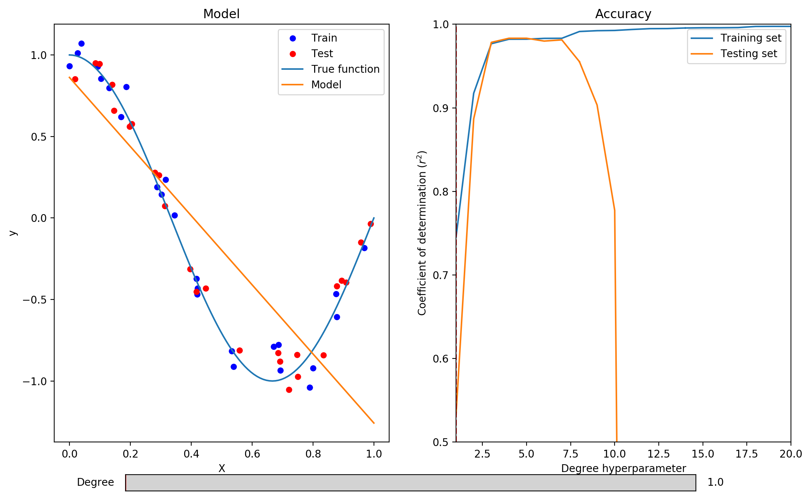
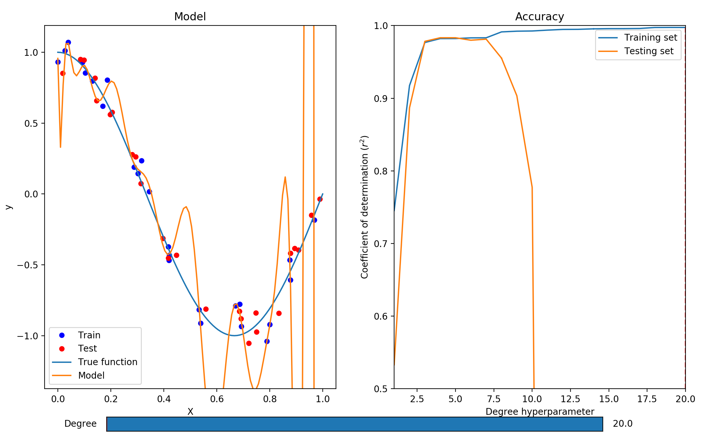

 **Exercise 1:** In this exercise, we will see how the complexity of the learned model affects overfitting and underfitting. We use [linear regression](http://scikit-learn.org/stable/modules/generated/sklearn.linear_model.LinearRegression.html) combined with [polynomial features](http://scikit-learn.org/stable/modules/generated/sklearn.preprocessing.PolynomialFeatures.html) of various degrees. Polynomial features allow to model non-linear functions with linear models. For instance, supposing that all examples are represented by a single feature  the corresponding polynomial features for a degree of 3 are .


Run the following command to start the interactive visualization.

```bash
make basics.model.complexity
```

Move the slider at the bottom of the plot to control the degree of the polynomial features. As the degree increases, so does the complexity of the learned model.

**1. Can you find a value of the degree hyperparameter that leads to underfitting?**

Yes, the algorithms underfits with degree = 1 and degree = 2. 
Its coefficient of determination is low both on the training and testing sets.
We can also observe that the model does not properly capture the variation in the data.



**2. Can you find a value of the degree hyperparameter that leads to overfitting?**

Yes, any values greater than 7 leads to overfitting. That is, the coefficient of determination is very high on the training set, 
but very low on the testing set.
We can also observe that the algorithm fits the training data so well that the model is fitted to random noise.



**3. If you were writing a paper about this model, which degree value would you use and which coefficient of determination would you report?**

This is a trick question. In this example, we did not use cross-validation, so we cannot select a proper value for the degree hyperparameter. Selecting a value based on the testing set would lead to a biased estimation of the model's accuracy, since the parameter would be selected to work well on the data used for the evaluation.
